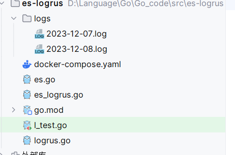
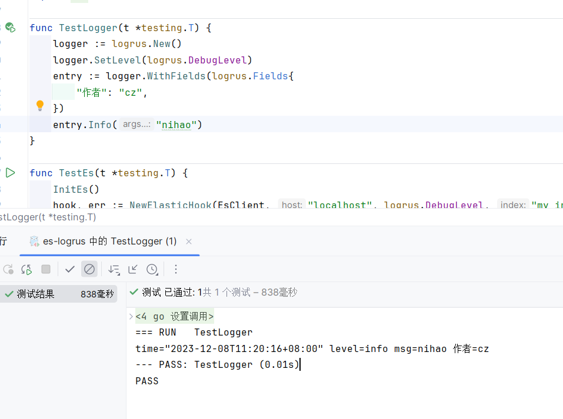
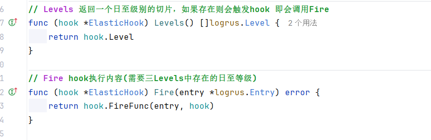
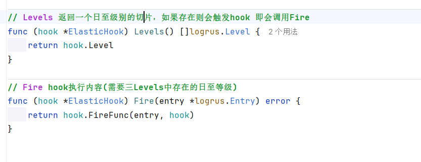

# 1.logrus介绍：

导入包：

``` shell
go get -u github.com/sirupsen/logrus
```


## 1.1 logrus基础配置：

```go
var LogrusObj *logrus.Logger


func InitLog() {
    if LogrusObj != nil {
       file, err := setOutputFile()
       if err != nil {
          panic(err)
       }
       LogrusObj.SetOutput(file)
       return
    }
    // 初始化
    logger := logrus.New()
    file, err := setOutputFile()
    if err != nil {
       panic(err)
    }
    logger.SetOutput(file)
    logger.SetLevel(logrus.DebugLevel)
    logger.SetFormatter(&logrus.JSONFormatter{
       TimestampFormat: "2006-01-02 15:04:05",
    })
    LogrusObj = logger
}
```


`setOutputFile`函数是设置日志输出的位置，这里的`setOutputFile`函数如下：

```go
// setOutputFile 按照日期进行分割，如果不存在则创建，存在就写入日至中
func setOutputFile() (*os.File, error) {
    now := time.Now()
    dir, err := os.Getwd()
    if err != nil {
       return nil, err
    }
    // 设置日志文件位置
    logFilePath := filepath.Join(dir, "/logs/")

    // 使用os.Stat 判断文件或文件夹是否存在
    // 如果返回 err是nil则表明文件或文件夹存在
    // 否则使用os.IsNotExists() 判断 ==》 如果为true则表明文件或文件夹不存在
    _, err = os.Stat(logFilePath)
    if os.IsNotExist(err) {
       // true 文件夹或文件不存在
       if err = os.MkdirAll(logFilePath, 0777); err != nil {
          log.Fatal(err)
          return nil, err
       }
    }
    // 文件夹存在
    logFileName := now.Format(FileNameLayOut) + ".log"
    fileName := filepath.Join(logFilePath, logFileName)

    // err不为空 则需要使用os.IsNotExists()判断文件是否存在
    if _, err = os.Stat(fileName); err != nil {
       if os.IsNotExist(err) {
          // 创建文件
          if _, err = os.Create(fileName); err != nil {
             log.Fatal(err)
             return nil, err
          }
       }
    }

    // 写入文件
    // O_WRONLY 以只写的方式
    // O_APPEND 追加
    // ModeAppend 只能写 且只能写到末尾
    file, err := os.OpenFile(fileName, os.O_APPEND|os.O_WRONLY, os.ModeAppend)
    if err != nil {
       return nil, err
    }

    return file, err
}
```

主要逻辑有以下：

- 获取项目的位置
- 使用`filepath.Join`将文件地址后加上`log`
- 使用`os.Stat`用于判断文件或文件夹是否存在，如果返回err是nil表明存在，如果不为nil则需要使用`os.IsNotExists()`，如果返回true表明文件或文件夹不存在
- 文件夹不存在则创建，使用`os.MkdirAll(路径，权限)`。
- 文件夹存在，则可以组装日志文件的文件名，然后通过这个文件名去判断当前文件是否存在，如果不存在则创建。
- 如果文件存在则可以直接进行追加，需要注意这里需要提供flag。` os.O_APPEND|os.O_WRONLY, os.ModeAppend`分别表示以只写的方式，追加的方式，后面的`os.ModeAppend`表示给写的权限并且只能写道末尾。


效果如图




## 1.2 logrus的其他配置：

logrus可以使用`WithFields`添加自己的一个字段，如：

```go
logger := logrus.New()
logger.SetLevel(logrus.DebugLevel)
entry := logger.WithFields(logrus.Fields{
    "作者": "cz",
})

entry.Info("nihao")
```




可以使用`entry.Data`返回的是一个`map[string]interface{}`就是刚才设置`WithFields`的值。


## 1.3 logrus的hook：

只需要实现`hook`这个接口，就可以了。

logrus调用中添加`AddHook(hook)`即可。


logrus的hook接口需要实现两个方法，如下：




其中`Levels`方法是返回什么日志级别才会触发hook的，而`Fire`则是具体实现hook的逻辑。


# 2.配置Es

引用库：

```go
github.com/elastic/go-elasticsearch
```


```GO
var EsClient *elasticsearch.Client

// InitEs 初始化es
func InitEs() {
    esConn := fmt.Sprintf("http://%s:%s", "192.168.61.129", "9200")
    cfg := elasticsearch.Config{
       Addresses: []string{esConn},
    }
    client, err := elasticsearch.NewClient(cfg)
    if err != nil {
       log.Panic(err)
    }
    EsClient = client
}
```


# 3.logrus实现日志推送

先定义一个结构体ElasticHook，其中需要实现`Hook`接口：




ElasticHook结构体如图所示：

``` go
type ElasticHook struct {
    Client        *elasticsearch.Client // es的客户端
    Host          string                // es的host
    Index         IndexNameFunc         // 获取索引的名字
    Level         []logrus.Level        // 日志级别
    Ctx           context.Context       // 上下文
    CtxCancelFunc context.CancelFunc    // 上下文的函数
    FireFunc      FireFunc              // 执行hook的方法
}
```


初始化es钩子：

```go
// NewElasticHook 创建一个es hook对象
func NewElasticHook(client *elasticsearch.Client, host string, level logrus.Level, index string) (*ElasticHook, error) {
    return newElasticHookWithFunc(client, host, level, func() string { return index })
}
```

具体逻辑如图：

```go
// newElasticHookWithFunc 创建一个es hook对象，通过IndexNameFunc这个方式
func newElasticHookWithFunc(client *elasticsearch.Client, host string, level logrus.Level, indexFunc IndexNameFunc) (*ElasticHook, error) {
    var levels []logrus.Level
    for _, l := range logrus.AllLevels {
       // 判断传入的level是在哪个等级上面
       if level >= l {
          levels = append(levels, l)
       }
    }
    ctx, cancelFunc := context.WithCancel(context.Background())
    return &ElasticHook{
       Client:        client,
       Host:          host,
       Index:         indexFunc,
       Level:         levels,
       Ctx:           ctx,
       CtxCancelFunc: cancelFunc,
       FireFunc:      syncFireFunc,
    }, nil
}
```

传入的level需要进行比较，比较日志是大于或等于的才会保存在这个钩子中的`Level`字段。


具体发送逻辑是`syncFireFunc`这个函数，具体用法如下：

主要是操作es逻辑。

```go
// syncFireFunc 异步发送 实现hook函数的具体逻辑
func syncFireFunc(entry *logrus.Entry, hook *ElasticHook) error {
    msg := createMessage(entry, hook)
    data, err := json.Marshal(&msg)
    if err != nil {
       return err
    }

    // 操作es
    request := esapi.IndexRequest{
       Index:   hook.Index(),
       Body:    bytes.NewReader(data),
       Refresh: "true",
    }

    // 发送请求
    resp, err := request.Do(hook.Ctx, hook.Client)
    if err != nil {
       return err
    }

    // 解析响应
    // todo 完善解析json的操作
    log.Println(resp.String())

    return nil
}
```

将这个赋值给`ElasticHook`的`FireFunc`，在调用钩子的时候调用即可。


最终使用`curl --location 'http://localhost:9200/my_index/_search'\?pretty `

即可查看到结果

# 4.完整代码


查看github

